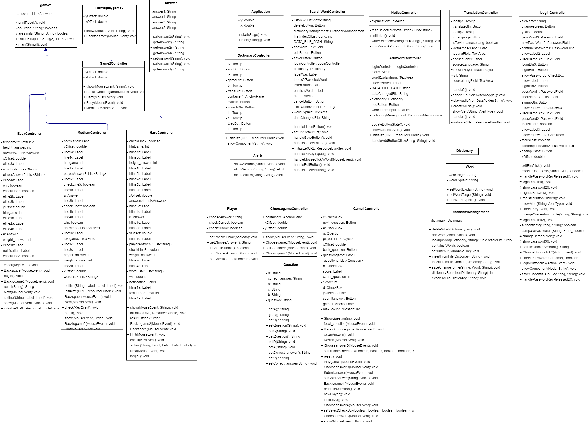

# Application to support learning English using Java
## Author
Group HHH

**1.** Nguyen Quang Huy - 22021110

**2.** Vu Van Huy - 22021202

**3.** Me Quang Huy - 22021142

## Description
The application is designed to support learning English. The application is written in Java and uses the JavaFX library. The application is based on the MVC model. The application has two types of dictionaries: English-Vietnamese and Vietnamese-English. The application use dictionaries.txt files to store data.

**1.** The application is designed to support learning English.

**2.** The application is written in Java and uses the JavaFX library.

**3.** The application has two types of dictionaries: English-Vietnamese and Vietnamese-English.

**4.** The application use dictionaries.txt files to store data.
## UML diagram


## Installation
**1.** Clone the project from the repository. ( link ``` https://github.com/huynqh0101/Dictionary_OOP.git ```)

**2.** Open the project in the IDE.

**3.** Run the project.

**4.** If you want to change the data, you can change the dictionaries.txt

## Usage
**1.** You will start with the login screen. If you do not have an account, please register an account to continue using.

**2.** The display screen after logging in will show daily vocabulary for you to learn.

**3.** To search for a word, tap the search button (Search icon).

   In addition, you can also edit words, delete words and update the dictionaries.txt file

**4.** To add a new word, click the Add button (Plus icon).

**5.** To translate, tap the translation button (Traslation icon).

- Select mode: English-Vietnamese or Vietnamese-English to choose the dictionary.

- Search for a word in the dictionary and click the Search button, then the right side of the window will display the meaning of the word.

- To pronounce the word, click the Pronounce button (Speaker icon).

**6.** To practice, click the Practice button (Play icon), then the application will display a Game window.

**7.** To exit the application, click the Exit button (Cross icon).

## Demo
[demo](https://drive.google.com/drive/folders/18OJygaIYOzIkildworENussj6nA4nLts?usp=drive_link)
## Future improvements

**1.** Add more dictionaries.  
**2.** Add more complex games.  
**3.** Optimize the word lookup algorithm.  
**4.** Use a database to store data.  
**5.** Integrate the application with API of Google Translate to translate paragraphs and whole documents.  
**6.** Integrate the application with API of Google Speech to Text to convert speech to text.  
**8.** Improve the user interface.  


## Notes
The application is written for educational purposes.
